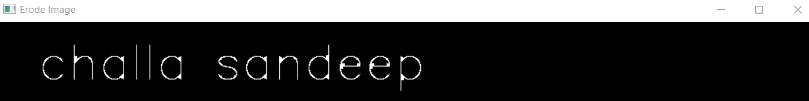

# Implementation-of-Erosion-and-Dilation
## Aim
To implement Erosion and Dilation using Python and OpenCV.
## Software Required
1. Anaconda - Python 3.7
2. OpenCV
## Algorithm:
### Step1:
Import the necessary packages to do Erosion and Dilution.
<br>


### Step2:
Create the text image of our name using putText from cv2 package.
<br>

### Step3:
Create the required structural element.
<br>

### Step4:
Apply Erode and Dilution for our NameImage.
<br>

### Step5:
Display the output images.
<br>

### step6:
End the programm
<br>

 
## Program:
### Developed by:challa sandeep
### Register number:212221240011

``` Python
# Import the necessary packages
import cv2
import numpy as np
import matplotlib.pyplot as plt

# Create the Text using cv2.putText
image= np.zeros((100,400),dtype='uint8')
font = cv2.FONT_HERSHEY_SIMPLEX
cv2.putText(image,' challa sandeep',(5,70), font,2,(255),5,cv2.LINE_AA)
cv2.imshow("Name",image)

# Create the structuring element
kernel1 = cv2.getStructuringElement(cv2.MORPH_CROSS,(7,7))

# Erode the image
erodeImage = cv2.erode(image,kernel1)
cv2.imshow("Erode Image",erodeImage)

# Dilate the image
dilationImage = cv2.dilate(image,kernel1)
cv2.imshow("Dilated Image",dilationImage)


cv2.waitKey(0)
cv2.DestroyAllWindows

```
## Output:

### Display the input Image


### Display the Eroded Image


### Display the Dilated Image


## Result
Thus the generated text image is eroded and dilated using python and OpenCV.
